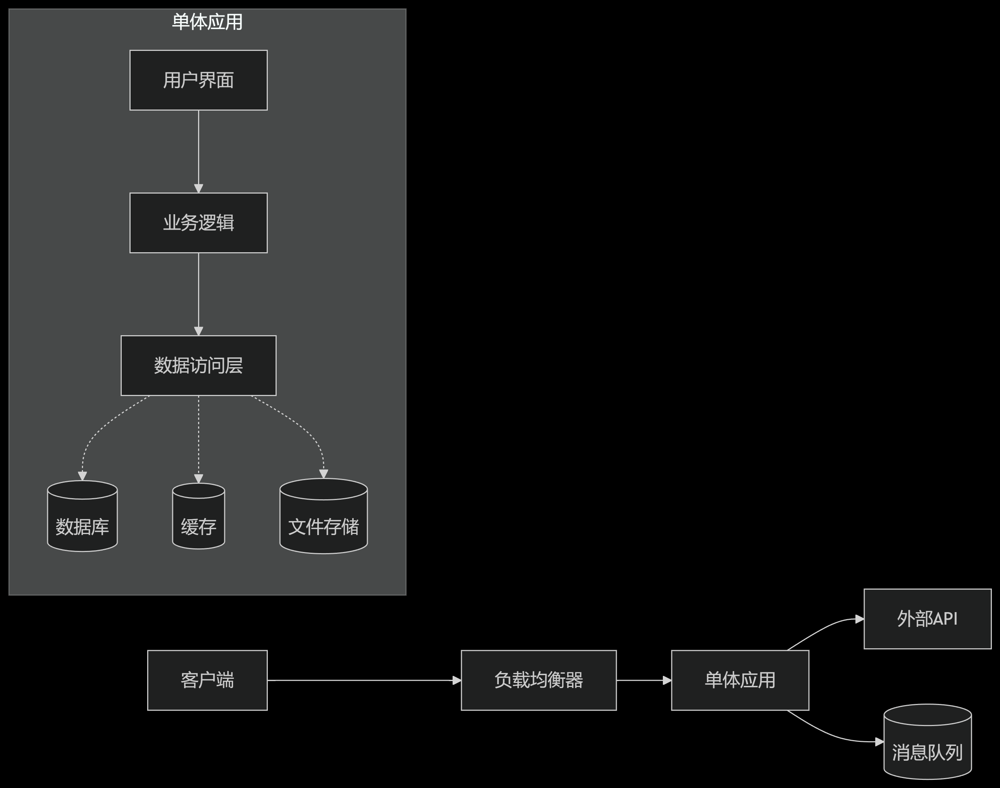

# Go微服务网关开发（1）

> 本章内容主要介绍了微服务网关是什么，以及微服务网关的核心功能。

## 什么是微服务？它有什么优势？

### 微服务架构介绍

> 官方表述：**"微服务是一种架构风格，将复杂应用程序分解为一组小的、松耦合的服务，每个服务专注于单一业务功能，围绕业务能力构建，可独立部署扩展。"**

通俗易懂解释：小诊所是一个整体，属于单体架构，而大型医院则将不同功能的服务分到不同科室，属于微服务架构。

**单体架构图**



**微服务架构图**



### 微服务的优势

> 官方表述：微服务适合**高并发、复杂业务、多团队协作**的场景，通过解耦带来极致的灵活性和扩展性，但需配套完善的DevOps体系支撑其运维复杂度。

通俗易懂解释：小诊所医生请假诊所关门便暂停服务，而医院的一个医生请假医院依旧正常运转，且小诊所医生需要掌握各种常发病的治疗方法，而医院的各个医生只需要负责对于的病症，效率更高，服务更好。

## 什么是微服务网关？为什么要有微服务网关？

### 微服务网关介绍

> 官方表述：**微服务网关（Microservice Gateway）** 是部署在微服务架构边缘的**服务入口层**，负责接收所有外部请求，并将其智能路由到后端对应的微服务实例。它作为服务边界的统一管控点，提供路由转发、负载均衡、安全认证、流量控制、协议转换等核心能力，是微服务架构中不可或缺的**流量协调中心**。

通俗易懂的解释：把一个大型项目想象成一个一所医院，医院有许多科室，每个科室都有不同的功能（**微服务**），而网关就是医院的前台，若没了前台，你便很难快速地找到相应的科室，且你每到一个科室都要登记，还有很大可能该科室已经有挂满号，让你空跑一趟，效率极低，而前台（网关）的出现便帮我们解决了这些痛点，护士会根据你的症状为你指引正确的科室（**路由转发** ），在前台登记后你便不用再重复登记（**安全认证**），在挂号时尽可能将病人分配到同一功能的不同科室以防止某个科室人数过多（**负载均衡**），若所有科室号都已挂满便会不再挂该科室的号（**流量控制**），同时前台可以监控各科室的情况（**日志/监控**），同时前台也在负责协调各个科室之间的通信（**协议转换**）。

### 微服务网关必要性

必要性：若无微服务网关，则整个微服务项目因耦合度过低，各个模块相互独立，客户端请求一个服务需要访问多个模块，且各个模块功能交互较为混乱，微服务的优势变成了劣势。

## 微服务网关的核心功能

> 这里我们先提供一个架构图



### 1.统一入口（API聚合）

* **作用**：所有客户端请求通过网关统一访问，避免直接暴露微服务细节。
* **场景**：客户端（如前端/移动端）只需与网关交互，无需知道内部服务地址（如 `/api/users` → 路由到用户服务）。
* **实现**：通过路由规则将请求分发到对应微服务。

**通俗易懂理解：去医院挂号不用去各个科室挂号，前台挂号即可。**

### 2.路由转发

* **作用**：根据请求规则将流量精准分发到后端微服务。
* **核心能力**：
  * **路径匹配**：如 `/orders/*` → 订单服务。
  * **权重路由**：按比例分配流量（如80%新版本，20%旧版本）。
  * **动态路由**：基于服务注册中心动态更新路由表。

**通俗易懂理解：去医院看病，前台会指引你去正确的科室。**

### 3. 安全认证

* **认证（Authentication）**：验证请求合法性（如 JWT、OAuth2.0、API Key）。
* **授权（Authorization）**：检查用户权限（如 VIP用户才能访问特定接口）。
* **限流（Rate Limiting）**：防止恶意请求或流量激增（如每秒100次/用户）。
* **HTTPS/TLS终止**：解密请求流量，减轻微服务安全负担。

**通俗易懂理解：看病无需去各个科室登记身份，前台登记即可**

### 4. 流量控制

* **负载均衡**：在多个服务实例间均匀分配请求（轮询/最少活跃/哈希）。
* **熔断（Circuit Breaker）**：服务故障时快速失败，避免级联崩溃（如 Hystrix/Sentinel）。
* **超时控制**：设置请求超时，防止资源阻塞。
* **重试机制**：对瞬态错误自动重试（如 502/503 错误）。

**通俗易懂理解：若科室号已挂满，前台便停止该科室挂号服务直至该科室有空闲。**

### 5. 协议转换

* **适配不同协议**：将 HTTP/HTTPS 转为 WebSocket/gRPC 或其他协议。
* **请求/响应处理**：
  * 映射请求路径（如 `/api/v1/` → 简化为 `/`）。
  * 数据格式转换（如 XML → JSON）。
  * 请求头修改（如添加 tracing ID）。

**通俗易懂理解：不同科室之间通过前台通信，前台负责将A科室的请求转换后发送到B科室。**

### 6. 日志监控

* **日志记录**：统一记录请求/响应日志（含时间、路径、状态码）。
* **监控指标**：收集延迟、QPS、错误率等数据（ Prometheus 格式）。
* **链路追踪**：注入 trace ID（如 Zipkin/Jaeger）。

**通俗易懂理解：前台可以监视各个科室发生的事件并记录。**

## 微服务架构未来发展

> 目前市面上各个大厂（如阿里、字节、腾讯等）都在使用微服务架构，即使是一些老项目也在用微服务重构。

| 企业       | 核心场景              | 微服务价值体现                                    |
| -------- | ----------------- | ------------------------------------------ |
| **阿里云**  | 双11大促（百万级TPS）     | 弹性扩容（秒级扩容1000+服务器）、故障隔离（订单宕机不影响商品浏览）       |
| **字节跳动** | 全球化短视频（抖音/TikTok） | 跨地域部署（不同区域独立服务实例）、多语言能力（Go/Java/Rust按需求选择） |
| **腾讯**   | 微信生态（10亿用户+）      | 服务自治（支付/消息/登录独立容灾）、灰度发布（A/B测试新功能）          |
| **美团**   | O2O全链路（交易到配送）     | 复杂业务解耦（骑手调度/优惠券/商户服务独立迭代）                  |

> 同时各个大厂也自研了微服务网关

| 企业       | 网关方案                      | 技术栈                | 应用场景       |
| -------- | ------------------------- | ------------------ | ---------- |
| **阿里云**  | MSE微服务引擎                  | 自研+Envoy+Dubbo     | 企业级多云混合云   |
| **字节跳动** | 自研高性能网关                   | Go+Rust+DPDK       | 全球化高并发     |
| **腾讯**   | API网关（TSF集成）              | Spring Cloud+Envoy | 金融级高可用     |
| **百度**   | 智能网关Baidu Cloud Mesh（BCM） | Istio+Kubernetes   | AI+大数据服务网关 |

> 微服务网关与云结合



**未来已来**：当网关能力完全云服务化后，企业将不再关心“网关在哪里”，只需定义“我要什么功能”——这正是云计算终极目标的体现。建议企业优先采用云厂商全托管网关服务，将精力聚焦在业务创新而非基础设施运维。

**综上可见，未来微服务将是软件行业发展趋势，微服务网关与云的结合将会产生新一轮的变革。**
