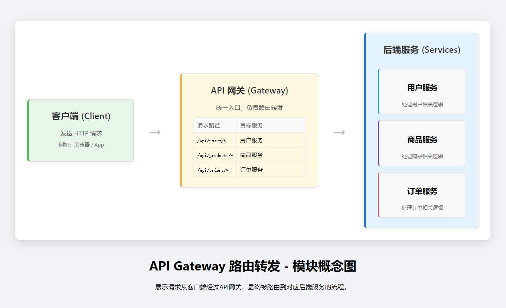
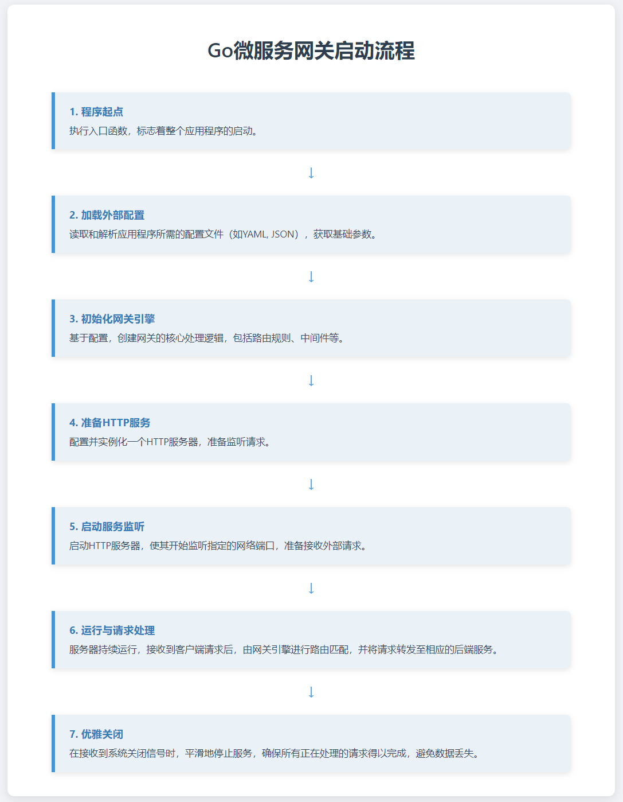

# Go微服务网关开发（2）：路由转发功能的实现

> 本章实现了API网关的路由转发功能

## 什么是路由转发功能

**路由转发功能**是指API网关将客户端请求转发到后端服务的功能。  

直观理解就是访问API网关端口（8080），会将请求转发到后端服务端口（8081、8082）等。  


> 路由转发功能示例图  





## 实现第一步：搭好文件结构

**首先，我们需要知道网关分为以下模块**  

- 配置文件

- 解析配置文件模块

- 网关核心模块

  - 反向代理模块

  - 路由模块

- 服务器模块
  
  

**其次，我们需要了解Go的常见架构**  

<br>

├── cmd  

├── internal    

└── pkg  

<br>

**cmd**：负责网关的入口  

**internal**：负责网关的内部模块，不暴露给外部使用  

**pkg**：负责暴露给外部使用的模块  


**最后，我们结合上面的模块与Go的常见架构，搭好文件结构**  

├── cmd  

│   　└── main.go   //网关的入口    

├── configs  

│   　└── config.yaml   //网关的配置文件      

├── internal  

│   　├── config  

│   　│   　└── config.go //解析配置文件模块  

│   　└── core  //核心模块  

│      　　　├── gateway.go //网关核心模块    

│      　　　├── proxy.go  //反向代理模块  

│      　　　├── route.go  //路由模块  

│      　　　└── server.go //服务器模块    

├── go.mod  

├── go.sum    

└── 文档


## 实现第二步：理解程序运行过程

1. **首先，先加载配置文件（config.yaml）并保存（这里命名为cfg）**

2. **根据cfg配置网关核心模块（这里命名为gw）**

3. **根据cfg和gw配置服务器（这里命名为srv）**

4. **启动服务器**

5. **运行服务**

6. **优雅关闭服务器**  

> 流程图




## 实现第三步：开始用代码实现

1. **首先，我们需要写好配置文件（config.yaml）**

> 思路为声明客户端端口并声明路由转发规则并配置要转发的路由路径与目标服务端口（本项目采用yaml文件配置，如果第一次接触可以花十分钟先去了解一下）

```yaml

# 配置文件


server:

  port: 8080 # 网关客户端的端口


# 路由配置

routes:

  # 路由service-a

  - id: service-a # 路由service-a的ID

    path: /service-a # 路由service-a的路径

    target: http://localhost:8081 # 路由service-a的目标服务端口


  # 路由service-b

  - id: service-b

    path: /service-b

    target: http://localhost:8082


# 通过上述配置，我们可以实现以下路由转发功能

# 当访问http://localhost:8080/service-a时，会将请求转发到http://localhost:8081/service-a

# 当访问http://localhost:8080/service-b时，会将请求转发到http://localhost:8082/service-b

```

---

2. **其次，我们需要写解析配置文件模块（config.go）来解析配置文件（config.yaml）**

> 思路为定义结构体并**利用yaml标签映射**配置文件中的字段，然后写LoadConfig函数根据传入的**配置文件地址**参数来解析配置文件（解析方法采用yaml.v3库）  


**定义结构体并利用yaml标签映射配置文件中的字段**

```go

type Config struct {

    Server Server   `yaml:"server"`

    Routes []*Route `yaml:"routes"`

}


type Server struct {

    Port string `yaml:"port"`

}


type Route struct {

    ID     string `yaml:"id"`

    Path   string `yaml:"path"`

    Target string `yaml:"target"`

}

```

**LoadConfig函数**

```go

func LoadConfig(config string) (*Config, error) {

    var cfg Config

    data, err := os.ReadFile(config)

    if err != nil {

        return nil, err

    }

    if err := yaml.Unmarshal(data, &cfg); err != nil {

        return nil, err

    }

    return &cfg, nil

}

```

---

3.**然后，我们需要写网关核心模块（gateway.go）、反向代理模块（proxy.go）和路由模块（route.go）**

> 我们需要知道反向代理模块和路由模块的都是网关的核心功能，但为了代码的可维护性，我们将它们分别写在不同的文件中，通过**依赖注入**的方式将它们注入到网关核心模块中。

---

**先写route.go**

> 只需要定义Route结构体，其中routes为所有所要转发的路由，并写一个NewRoute函数用于创建结构体，再写一个FindRoute用于查找匹配路由（可采用字典树查询方式，本项目先采用遍历的方式。）


**定义结构体并写出NewRoute函数**

```go

type Router struct {

    routes []*config.Route

}


func NewRouter(routes []*config.Route) *Router {

    return &Router{

        routes: routes,

    }

}

```

**FindRoute函数**

```go

func (r *Router) FindRoute(path string) *config.Route {

    // 遍历查找匹配的路由

    for _, route := range r.routes {

        // 检查路径是否匹配

        if strings.HasPrefix(path, route.Path) {

            return route

        }

    }

    return nil

}

```

---

**再写proxy.go**

> 定义结构体并写出NewProxy函数(目前未额外添加其他功能，只是将结构分离便于拓展)，并实现ServeHTTP方法使其成为一个Handler。


**定义结构体并写出NewProxy函数**

```go

type Proxy struct {

}


func NewProxy() *Proxy {

    return &Proxy{}

}

```

**实现反向代理的核心功能 - ServeHTTP方法（核心）**  

> ServeHTTP是Go语言中http.Handler接口的核心方法，它是HTTP请求处理的入口点，实现了ServeHTTP方法就相当于把对象变成了Handler。

```go

func (p *Proxy) ServeHTTP(w http.ResponseWriter, r *http.Request, route *config.Route) {

    // 解析目标服务URL

    targetURL, err := url.Parse(route.Target)

    if err != nil {

        http.Error(w, "无效的目标服务地址", http.StatusInternalServerError)

        return

    }


    // 创建反向代理

    proxy := httputil.NewSingleHostReverseProxy(targetURL)


    // 保存原始路径用于日志记录

    originalPath := r.URL.Path


    // 设置反向代理的Director

    proxy.Director = func(req *http.Request) {

        // 设置目标服务的协议和主机

        req.URL.Scheme = targetURL.Scheme

        req.URL.Host = targetURL.Host

        // 处理路径映射

        req.URL.Path = targetURL.Path + strings.TrimPrefix(req.URL.Path, route.Path)

    }


    // 记录转发日志

    log.Printf("转发请求: %s %s -> %s://%s%s", r.Method, originalPath, targetURL.Scheme, targetURL.Host, r.URL.Path)


    // 转发请求

    proxy.ServeHTTP(w, r)

}

```

---

最后，我们需要将反向代理模块和路由模块注入到网关核心模块中。

> 定义Gateway结构体并注入反向代理模块和路由模块，并写出NewGateway函数，同时实现ServeHTTP方法使其成为一个Handler。


**定义结构体并注入反向代理模块和路由模块**

```go

type Gateway struct {

    config *config.Config

    router *Router

    proxy  *Proxy

}


func NewGateway(config *config.Config) *Gateway {

    return &Gateway{

        config: config,

        router: NewRouter(config.Routes),

        proxy:  NewProxy(),

    }

}

```

**实现网关核心功能 - ServeHTTP方法（核心）**

```go

func (g *Gateway) ServeHTTP(w http.ResponseWriter, r *http.Request) {

    // 查找匹配的路由

    route := g.router.FindRoute(r.URL.Path)

    if route == nil {

        http.Error(w, "路由未找到", http.StatusNotFound)

        return

    }


    // 转发请求

    g.proxy.ServeHTTP(w, r, route)

}

```

4.上述实现完成后我们开始写服务器

> 写服务器的思路很直接，就是定义一个Server结构体（其中封装了一个http.Server）并给出NewServer函数用于创建结构体，同时定义一个Start方法用于启动服务器。

**定义结构体并写出NewServer函数**

```go

type Server struct {

    httpServer *http.Server

}


func NewServer(addr string, handler http.Handler) (*Server, error) {

    srv := &http.Server{

        Addr:    addr,

        Handler: handler,

    }

    return &Server{

        httpServer: srv,

    }, nil

}

```

**实现启动服务器的Start方法（重点在于优雅关闭）**

> 服务器启动时，我们需要在一个goroutine中启动服务器以便能监听中断信号，同时在主goroutine中等待中断信号，收到信号后我们需要优雅关闭服务器（**优雅关闭确保服务器立即停止接收新连接请求，但会等待所有已建立的连接和正在处理的请求正常完成，避免用户请求被强制中断和数据丢失，同时设置30秒超时保护机制，超时后强制关闭以保证系统资源能够及时释放**）。

```go

func (s *Server) Start() error {

    // 在goroutine中启动服务器以便能监听中断信号

    go func() {

        if err := s.httpServer.ListenAndServe(); err != nil && err != http.ErrServerClosed {

            log.Fatalf("服务器启动失败: %v", err)

        }

    }()


    log.Printf("服务器正在监听地址 %s", s.httpServer.Addr)


    // 等待中断信号

    quit := make(chan os.Signal, 1)

    signal.Notify(quit, syscall.SIGINT, syscall.SIGTERM)

    <-quit


    log.Println("正在关闭服务器...")


    // 优雅关闭

    ctx, cancel := context.WithTimeout(context.Background(), 30*time.Second)

    defer cancel()


    if err := s.httpServer.Shutdown(ctx); err != nil {

        log.Fatal("服务器关闭错误:", err)

    }


    log.Println("服务器已关闭")

    return nil

}

```

---

5.最后，我们在main函数中创建网关、路由模块、反向代理模块、服务器模块，并启动服务器即可。

> 顺序为：加载配置 -> 创建网关 -> 创建服务器 -> 启动服务器

```go

package main


import (

    "gateway/internal/config"

    "gateway/internal/core"

    "log"

)


func main() {

    // 加载配置

    log.Println("开始加载配置")

    cfg, err := config.LoadConfig("configs/config.yaml")

    if err != nil {

        log.Fatal("加载配置失败:", err)

    }

    log.Println("加载配置成功")


    // 创建网关

    log.Println("开始创建网关")

    gw := core.NewGateway(cfg)

    log.Println("网关创建成功")


    // 创建服务器

    log.Println("开始创建服务器")

    // 修复：确保端口地址格式正确

    addr := ":" + cfg.Server.Port

    srv, err := core.NewServer(addr, gw)

    if err != nil {

        log.Fatal("创建服务器失败:", err)

    }

    log.Println("服务器创建成功")


    // 启动服务器

    log.Printf("服务器正在监听端口 %s", cfg.Server.Port)

    if err := srv.Start(); err != nil {

        log.Fatal("服务器启动失败:", err)

    }

    log.Println("服务器已启动")

}

```

## 最后一步 测试网关

> 首先启动8081和8082端口的服务端，然后启动网关（8080），最后使用curl或postman测试网关是否正常工作。


启动8081和8082端口的命令

```bash

python3 -m http.server 8081

python3 -m http.server 8082

```

启动网关开始测试

```bash

# 启动网关

cd /home/leon/GoCode/30daysGateway/day1

go run cmd/main.go


# 在另一个终端测试路由转发

curl http://localhost:8080/service-a

curl http://localhost:8080/service-b

```

可见输入访问http://localhost:8080/service-a，返回了8081端口的响应，访问http://localhost:8080/service-b也返回了8082端口的响应，说明网关正常工作。


---

**本章结束。**
