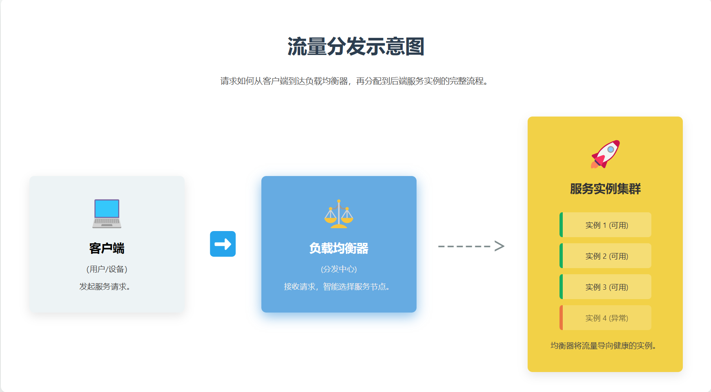

# Go微服务网关开发（3）：负载均衡功能的实现

> 本章在Day1路由转发的基础上，实现了负载均衡功能，支持轮询算法分发请求到多个后端服务


[完整项目地址](https://github.com/LeoninCS/Go-gateway)(已开发80%的功能)


[30天开发地址](https://github.com/LeoninCS/30daysGateway)(将项目分为30天开发，附详细技术文档与代码解析)\

欢迎star✨


## 什么是负载均衡功能

**负载均衡功能**是指一个服务有多个实例，当有请求过来时，网关会根据负载均衡算法（如轮询）将请求分发到不同的实例上，以实现负载均衡和高可用性。  


> 负载均衡功能示意图  




**与路由转发的区别：路由转发是将请求匹配到相应的服务，而负载均衡则是将请求分发到同一服务的不同实例上。（可避免一个服务实例过载或者故障导致整个服务不可用）**

## 实现第一步：理解Day2的架构变化

**Day2在Day1的基础上新增了以下模块**  

- 负载均衡器接口和实现

- 后端服务管理模块

- 多目标路由配置支持  


**之所以负载均衡器采用接口的方式而非直接实现，是为了**解耦**和**可扩展性**，既未来可以方便地替换其他负载均衡算法。**  


**Day2的文件结构变化**  

在internal/core添加了loadbalancer  

- backend.go：定义后端服务管理模块

- loadbalancer.go：定义负载均衡器接口和轮询实现

- round_robin.go：实现轮询负载均衡算法


## 实现第二步：实现负载均衡功能

1.负载均衡器主要功能就是选择一个后端服务实例来处理请求，因此首先定义后端服务管理模块（backend.go），用于存储和管理后端服务实例。

> 定义结构体，包括后端服务实例的ID、URL、状态（是否存活）和互斥锁（用于处理并发）。

```go

type Backend struct {

    ID    string

    URL   *url.URL

    mu    sync.Mutex

    Alive bool

}

```

> 定义两个方法，一个用于设置后端服务实例的存活状态，另一个用于获取后端服务实例的存活状态。

```go

func (b *Backend) SetAlive(alive bool) {

    b.mu.Lock()

    defer b.mu.Unlock()

    b.Alive = alive

}


func (b *Backend) IsAlive() bool {

    b.mu.Lock()

    defer b.mu.Unlock()

    return b.Alive

}

```

2.定义负载均衡器接口（loadbalancer.go），包括添加后端服务实例、删除后端服务实例、选择后端服务实例等方法。

```go

type LoadBalancer interface {

    GetNextTarget() *Backend // 获取下一个目标后端服务实例

    AddBackend(backend *Backend) // 添加后端服务实例

    RemoveBackend(backend *Backend) // 删除后端服务实例

    GetBackends() []*Backend // 获取所有后端服务实例

}

```

3.开始实现轮询负载均衡算法（round_robin.go），即按顺序选择下一个活着的后端服务实例。

> 定义结构体，主要包括后端服务实例列表、当前选择的后端索引（打上标记便于选择下一个）和互斥锁（用于处理并发）。

```go

type RoundRobinLoadBalancer struct {

    backends []*Backend

    current  int

    mutex    sync.Mutex

}

```

开始实现具体的方法

> 实现构造函数，用于创建一个新的轮询负载均衡器实例。  

> 实现获取下一个目标后端服务实例的方法，按顺序选择下一个活着的后端服务实例。  

> 实现添加后端服务实例的方法，将新的后端服务实例添加到列表中。  

> 实现删除后端服务实例的方法，将指定的后端服务实例从列表中移除。  

> 实现获取所有后端服务实例的方法，返回当前所有后端服务实例的列表。  

```go

func NewRoundRobinLoadBalancer() *RoundRobinLoadBalancer {

    return &RoundRobinLoadBalancer{

        backends: make([]*Backend, 0),

        current:  -1,

    }

}


// 跳转到下一个可用的后端

func (r *RoundRobinLoadBalancer) GetNextTarget() *Backend {

    r.mutex.Lock()

    defer r.mutex.Unlock()


    if len(r.backends) == 0 {

        return nil

    }

    r.current = (r.current + 1) % len(r.backends)

    for !r.backends[r.current].IsAlive() {

        r.current = (r.current + 1) % len(r.backends)

    }

    return r.backends[r.current]

}

// 添加后端服务实例

func (r *RoundRobinLoadBalancer) AddBackend(backend *Backend) {

    r.mutex.Lock()

    defer r.mutex.Unlock()

    r.backends = append(r.backends, backend)

}

// 删除后端服务实例

func (r *RoundRobinLoadBalancer) RemoveBackend(backend *Backend) {

    r.mutex.Lock()

    defer r.mutex.Unlock()

    for i, b := range r.backends {

        if b.ID == backend.ID {

            r.backends = append(r.backends[:i], r.backends[i+1:]...)

            return

        }

    }

}

// 获取所有后端服务实例

func (r *RoundRobinLoadBalancer) GetBackends() []*Backend {

    r.mutex.Lock()

    defer r.mutex.Unlock()

    return r.backends

}

```

## 实现第三步，修改其他部分使整个项目可以运行

1. 修改路由模块（route.go），添加负载均衡器字段，用于选择后端服务实例。

```yaml

routes:

  # 路由service-a

  - id: service-a

    path: /service-a

    targets:

          - http://localhost:8081

          - http://localhost:8082

  # 路由service-b

  - id: service-b

    path: /service-b

    targets:

          - http://localhost:8083

          - http://localhost:8084

```

对比Day1,可以看到仅仅是每个服务从一个target变成了多个target，这是为了支持负载均衡功能。

```yaml

routes:

  # 路由service-a

  - id: service-a

    path: /service-a

    target: http://localhost:8081


  # 路由service-b

  - id: service-b

    path: /service-b

    target: http://localhost:8082

```

2. 修改config.go,使其正确映射（修改Route结构体即可）

```go

type Route struct {

    ID      string   `yaml:"id"`

    Path    string   `yaml:"path"`

    Targets []string `yaml:"targets"`

}

```

3.修改proxy.go,添加负载均衡器字段，用于选择后端服务实例。

首先在结构体里面添加一个字段，用于存储每个服务的负载均衡器实例。

```go

type Proxy struct {

    loadbalancers map[string]loadbalancer.LoadBalancer

}

```

实现构造函数，用于创建一个新的代理实例（初始化负载混衡器并将所有后端服务实例添加到负载混衡器中）。

```go

func NewProxy(backends []*config.Route) *Proxy {

    loadbalancers := make(map[string]loadbalancer.LoadBalancer)

    for _, backend := range backends {

        lb := loadbalancer.NewRoundRobinLoadBalancer()

        for _, target := range backend.Targets {

            backendURL, _ := url.Parse(target)

            lb.AddBackend(&loadbalancer.Backend{

                ID:    backend.ID,

                URL:   backendURL,

                Alive: true,

            })

        }

        loadbalancers[backend.ID] = lb

    }

    return &Proxy{

        loadbalancers: loadbalancers,

    }

}

```

修改ServeHTTP方法，使用负载均衡器选择后端服务实例。  


```go

    //修改点

    backend := p.loadbalancers[route.ID].GetNextTarget()

    if backend == nil {

        http.Error(w, "无可用后端服务", http.StatusServiceUnavailable)

        return

    }

    // 创建反向代理

    proxy := httputil.NewSingleHostReverseProxy(backend.URL)

    //后面一样

```

此时应该已经可以正确运行，**若有报错大家自行修改，应该只是些类似于传参的低级错误，因为文章不便讲解每个修改的部分，但已将重要的修改点都标注出来了，其中一些低级的错误大家可以自己修改，若实在有问题也可以参考完整项目（已完成测试）或者联系作者。**

## 最后一步 测试网关

> 首先启动8081,8082,8083,8084端口的服务端，然后启动网关（8080），最后使用curl或postman测试网关是否正常工作。(注意：大家先勿过度测试，确保负载均衡功能可以正常运行即可，还有很多问题接下来会一一解决。)


启动8081,8082,8083,8084端口的服务端的命令

```bash

python3 -m http.server 8081

python3 -m http.server 8082

python3 -m http.server 8083

python3 -m http.server 8084

```

启动网关开始测试

```bash

# 启动网关

cd /home/leon/GoCode/30daysGateway/day2

go run cmd/main.go


# 在另一个终端测试路由转发

curl http://localhost:8080/service-a

curl http://localhost:8080/service-a

curl http://localhost:8080/service-a

curl http://localhost:8080/service-b

curl http://localhost:8080/service-b

curl http://localhost:8080/service-b

```

可见第一次访问http://localhost:8080/service-a，返回了8081端口的响应，第二次访问返回了8082端口的响应，第三次访问返回了8081端口的响应，说明负载均衡功能正常工作。service-b也同理。


---

**本章结束。**
