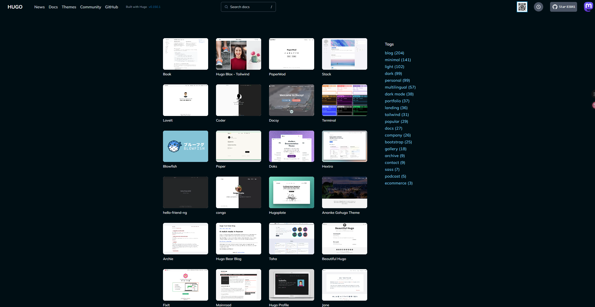
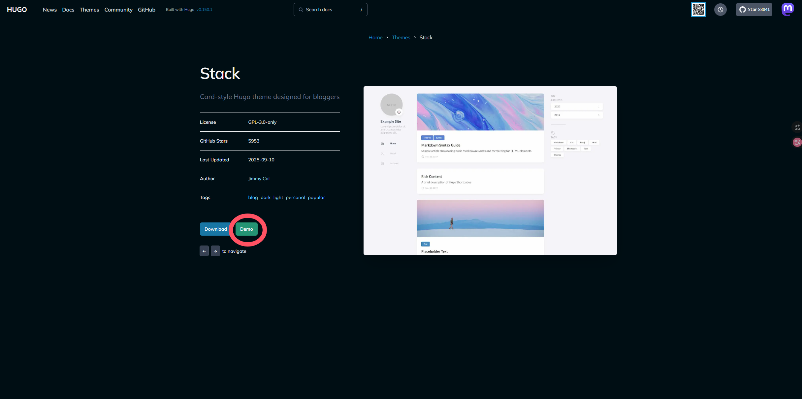
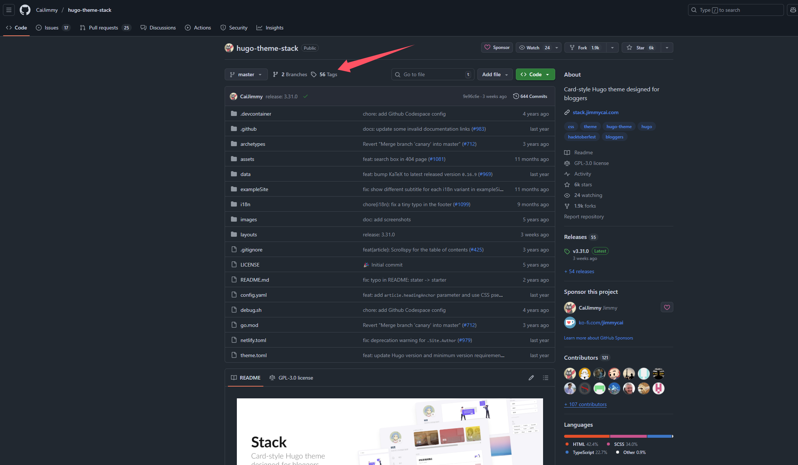
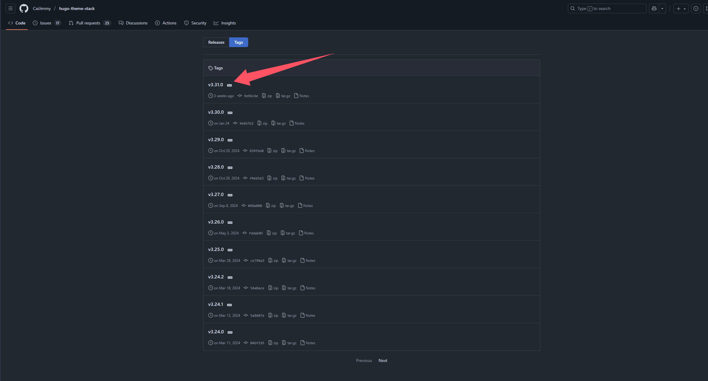
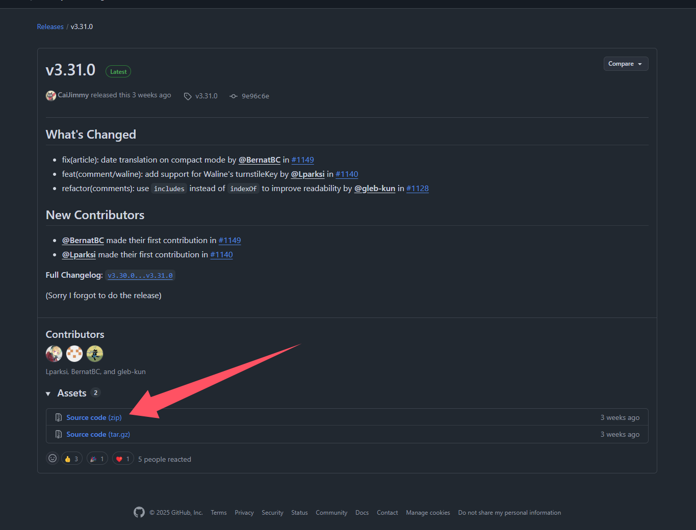
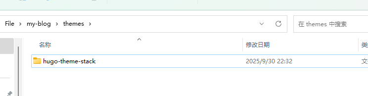

# Hugo + GitHub快速搭建个人博客

**[视频教程]()**

## 引言

一直想拥有一个属于自己的个人博客，分享技术心得或生活点滴？也许你曾被 WordPress 的笨重、服务器的费用或是某些平台有限的自定义功能劝退。

如果我告诉你，有一种方法可以让你**免费**、**极速**地搭建一个完全由你掌控的现代化博客，你是否会心动？

本文将带你走进 `Hugo` + `GitHub Pages` 的世界。我们将利用 Hugo 的闪电般的速度和 GitHub 的免费托管服务，从零开始，一步步打造一个优雅、高效且无需任何花费的个人网站。准备好，让我们开始构建吧！

**Hugo**：Go语言编写的超高速静态网站生成器。

**Git**：一个免费、开源的分布式版本控制系统。

**Github**：全球最大的基于Git的代码托管与协作平台。

## 环境准备

* 安装Hugo  [Hugo安装](https://gohugo.com.cn/installation/)

* 安装Git  [Git安装](https://git-scm.cn/book/en/v2/Getting-Started-Installing-Git)

* 注册一个GitHub账号  [GitHub注册]([Sign up for GitHub · GitHub](https://github.com/signup?return_to=%2F&source=login))

**本文章仅提供在windows上安装教程**

1. **安装 Git**
   
   * 访问 [git-scm.com/downloads](https://git-scm.com/downloads) 下载 Windows 版的 Git。
   * 运行安装程序，一路点击 "Next" 使用默认选项完成安装即可。

2. **安装 Hugo Extended**
   
   * 点击“开始”菜单，输入 `PowerShell`，选择 **“Windows PowerShell”** (不要选“以管理员身份运行”)。
   
   * 在打开的 PowerShell 窗口中，**依次执行**以下三行命令（复制一行，按 Enter，再复制下一行
   
   ```powershell
   # 1. 允许当前用户执行远程脚本 (只需执行一次)
   Set-ExecutionPolicy RemoteSigned -Scope CurrentUser
   # (如果询问，输入 Y 并回车)
   # 2. 安装 Scoop 包管理器
   irm get.scoop.sh | iex
   # 3. 使用 Scoop 安装 Hugo Extended 版本 (功能最全)
   scoop install hugo-extended
   
   ```

*打开终端验证安装是否成功*

按下win+R，输入cmd，回车进入终端，输入以下命令

```powershell
git --version 
hugo version
```


如果能看到版本号，说明安装成功。

## 创建本地博客项目

1. 打开终端，`cd` 到你希望存放博客项目的文件夹。

2. 运行以下命令来创建一个新的 Hugo 站点。我们将博客项目命名为 `my-blog`。

```powershell
hugo new site my-blog
```

3. 进入刚刚创建的目录并初始化Git仓库

```powershell
cd my-blog
git init
```

## 添加主题

### 选择主题

 [Hugo官方主题库](https://themes.gohugo.io/)

**由于各个主题文件目录不同，配置方法也有所差异，但大体相同，可借助AI帮助配置，本文仅展示stack主题的配置**



选择一个点击进去，点击demo即可看到主题的效果,点击download即可跳转到github仓库



点击tag



下载最新版本



下载源码



解压缩到themes文件夹，并将名字中的版本号去掉，效果如下



### 配置主题

在 `my-blog` 目录下，执行以下命令（仅针对本项目，功能是提取作者的演示案例作为初始项目，并清除作者的演示案例）

```powershell
:: 强制删除当前目录的 content 文件夹（若存在）
rd /s /q content 2>nul

:: 将主题示例的 content 复制到当前目录
xcopy "themes\hugo-theme-stack\exampleSite\content" "content" /E /I /H /Y

:: 删除 exampleSite 文件夹
rd /s /q "themes\hugo-theme-stack\exampleSite" 2>nulontinue

:: 删除 rich-content 文件夹
rd /s /q "content/post/rich-content"
```

删除hugo.toml，并创建hugo.yaml (进入相应文件夹删除创建即可)

将下面模板代码完整复制到config.yaml文件中，根据注释修改你的信息

```yaml
# 站点基础配置
baseurl: https://example.com/           # 网站根URL
languageCode: en-us                     # 默认语言代码
theme: hugo-theme-stack                 # 使用的主题名称
title: Example Site                     # 网站标题
copyright: Example Person               # 版权信息

# 国际化配置
# 支持的语言: ar, bn, ca, de, el, en, es, fr, hu, id, it, ja, ko, nl, pt-br, th, uk, zh-cn, zh-hk, zh-tw
DefaultContentLanguage: en              # 默认内容语言

# 如果默认语言是中文/日文/韩文，需设置为true
# 这将使.Summary和.WordCount对CJK语言正常工作
hasCJKLanguage: false

# 多语言详细配置
languages:
    en:
        languageName: English           # 语言显示名称
        title: Example Site             # 该语言下的网站标题
        weight: 1                       # 权重（排序用）
        params:
            sidebar:
                subtitle: Example description  # 侧边栏副标题
    zh-cn:
        languageName: 中文
        title: 演示站点
        weight: 2
        params:
            sidebar:
                subtitle: 演示说明
    ar:
        languageName: عربي
        languagedirection: rtl          # 文本方向（阿拉伯语从右到左）
        title: موقع تجريبي
        weight: 3
        params:
            sidebar:
                subtitle: وصف تجريبي

# 第三方服务配置
services:
    # Disqus评论系统（使用前需修改为你的shortname）
    disqus:
        shortname: "hugo-theme-stack"
    # Google Analytics跟踪ID
    googleAnalytics:
        id:                             # 填入你的GA跟踪ID

# 分页设置
pagination:
    pagerSize: 3                        # 分页器显示页码数量

# 永久链接格式
permalinks:
    post: /p/:slug/                     # 文章URL格式
    page: /:slug/                       # 页面URL格式

# 主题参数配置
params:
    mainSections:
        - post                         # 主要内容区域
    featuredImageField: image          # 特色图片字段名
    rssFullContent: true               # RSS是否包含全文
    favicon:                           # 网站图标路径，如：/favicon.ico

    # 页脚设置
    footer:
        since: 2020                    # 起始年份
        customText:                    # 自定义文本

    # 日期格式
    dateFormat:
        published: Jan 02, 2006        # 发布日期格式
        lastUpdated: Jan 02, 2006 15:04 MST  # 最后更新日期格式

    # 侧边栏设置
    sidebar:
        emoji: 🍥                      # 表情图标
        subtitle: Lorem ipsum dolor sit amet, consectetur adipiscing elit.  # 副标题
        avatar:
            enabled: true              # 是否显示头像
            local: true                # 是否使用本地图片
            src: img/avatar.png        # 头像路径

    # 文章设置
    article:
        math: false                    # 是否支持数学公式
        toc: true                      # 是否显示目录
        readingTime: true              # 是否显示阅读时间
        license:
            enabled: true              # 是否显示版权信息
            default: Licensed under CC BY-NC-SA 4.0  # 默认许可证

    # 评论系统配置
    comments:
        enabled: true                  # 启用评论
        provider: disqus               # 评论提供商

        # 各评论系统的具体配置
        disqusjs: {...}                # DisqusJS配置
        utterances: {...}              # Utterances配置（GitHub-based）
        beaudar: {...}                 # Beaudar配置
        remark42: {...}                # Remark42配置
        vssue: {...}                   # Vssue配置
        waline: {...}                  # Waline配置
        twikoo: {...}                  # Twikoo配置
        cactus: {...}                  # Cactus Chat配置
        giscus: {...}                  # Giscus配置（GitHub Discussions）
        gitalk: {...}                  # Gitalk配置
        cusdis: {...}                  # Cusdis配置

    # 小工具配置
    widgets:
        homepage:                      # 首页小工具
            - type: search             # 搜索框
            - type: archives           # 文章归档
              params:
                  limit: 5             # 显示数量
            - type: categories         # 分类
              params:
                  limit: 10
            - type: tag-cloud          # 标签云
              params:
                  limit: 10
        page:
            - type: toc                # 页面目录

    # OpenGraph设置（社交媒体分享）
    opengraph:
        twitter:
            site:                      # Twitter用户名
            card: summary_large_image  # 卡片类型：summary或summary_large_image

    # 默认图片设置
    defaultImage:
        opengraph:
            enabled: false             # 是否启用
            local: false               # 是否使用本地图片
            src:                       # 图片路径

    # 颜色方案
    colorScheme:
        toggle: true                   # 是否显示切换按钮
        default: auto                  # 默认模式：auto, light, dark

    # 图片处理
    imageProcessing:
        cover:
            enabled: true              # 处理封面图片
        content:
            enabled: true              # 处理内容图片

# 自定义菜单配置
menu:
    main: []                           # 主导航菜单

    social:                            # 社交链接菜单
        - identifier: github
          name: GitHub
          url: https://github.com/CaiJimmy/hugo-theme-stack
          params:
              icon: brand-github       # 图标名称

# 相关文章设置
related:
    includeNewer: true                 # 是否包含较新文章
    threshold: 60                      # 相关度阈值
    toLower: false                     # 是否忽略大小写
    indices:
        - name: tags                   # 使用标签作为关联依据
          weight: 100                  # 权重
        - name: categories             # 使用分类作为关联依据
          weight: 200

# Markdown渲染设置
markup:
    goldmark:
        extensions:
            passthrough:
                enable: true           # 启用原始HTML通过
                delimiters:
                    block:             # 块级分隔符
                        - - \[
                          - \]
                        - - $$
                          - $$
                    inline:            # 行内分隔符
                        - - \(
                          - \)
        renderer:
            unsafe: true               # 允许不安全HTML（直接渲染HTML内容）
    tableOfContents:
        endLevel: 4                    # 目录结束级别
        ordered: true                  # 是否有序
        startLevel: 2                  # 目录开始级别
    highlight:
        noClasses: false               # 是否使用内联样式
        codeFences: true               # 启用代码围栏
        guessSyntax: true              # 自动猜测语法
        lineNoStart: 1                 # 行号起始值
        lineNos: true                  # 显示行号
        lineNumbersInTable: true       # 在表格中显示行号
        tabWidth: 4                    # 制表符宽度

```

**重点：** 务必修改 `baseURL`、`title`、`avatar.src` 和 `social` 部分的内容为你自己的信息。

### 本地预览

在发布到互联网前，先在本地预览效果。

在 `my-blog` 目录的 PowerShell 中执行：

```powershell
hugo server -D
```

终端会提示一个地址，通常是 `http://localhost:1313/`。在浏览器中打开它，你应该能看到你的博客了。

## 托管代码到 GitHub 并设置自动化部署

### 创建并设置源代码仓库

* **登录 GitHub**，创建一个新仓库用于存放博客的**源代码**。
  * **Repository name**: **`<你的用户名>.github.io`** (这是获取顶级访问域名的关键，例如用户名 `john` 则仓库名为 `john.github.io`)。
  * 将仓库 visibility 设为 **Public** (私有仓库需要付费账户才能使用 Pages 功能)。
  * **不要**勾选 "Initialize this repository with a README"。
* 创建完成后，复制仓库的 **HTTPS** 地址（格式为 `https://github.com/<你的用户名>/<你的用户名>.github.io.git`）。

### 推送本地代码到仓库

在本地终端 (如 PowerShell) 中，进入你的 Hugo 站点根目录 (例如 `my-blog`)，执行以下命令：

```powershell
# 关联远程仓库（地址替换为刚复制的地址）
git remote add origin https://github.com/<你的用户名>/<你的用户名>.github.io.git
# 添加所有文件到暂存区并提交
git add .
git commit -m "Initial commit with Hugo site and Stack theme"
# 将本地 main 分支推送到 GitHub 并设为上游分支
git branch -M main
git push -u origin main
```

### 配置自动化部署 (GitHub Actions)

- 设置Github Pages
  
  - 点击Settings
  
  - 点击左侧Pages
  
  - 将Buile and depolyment由Deploy from branch 改为 GitHub Actions
* 在本地站点根目录下，创建目录结构：`.github/workflows/`，并在 `workflows` 目录中新建文件 `deploy.yml`。

* 用文本编辑器打开 `deploy.yml`，粘贴以下工作流配置（该配置使用官方推荐 Actions，支持自动构建、发布）：

```yaml
name: Deploy Hugo Site to Pages

on:
  push:
    branches: ["main"]   # 代码推送至 main 分支时触发
  workflow_dispatch:     # 支持手动触发

permissions:
  contents: read
  pages: write
  id-token: write

concurrency:
  group: "pages"
  cancel-in-progress: false

jobs:
  build:
    runs-on: ubuntu-latest
    steps:
      - name: Checkout code
        uses: actions/checkout@v4
        with:
          submodules: recursive  # 自动拉取主题子模块
          fetch-depth: 0

      - name: Setup Hugo
        uses: peaceiris/actions-hugo@v2
        with:
          hugo-version: 'latest'
          # extended: true       # 若主题需扩展版，取消注释

      - name: Build with Hugo
        run: hugo --minify --gc   # 生成优化后的静态文件

      - name: Upload artifact
        uses: actions/upload-pages-artifact@v3
        with:
          path: ./public          # 上传生成的站点文件

  deploy:
    environment:
      name: github-pages
      url: ${{ steps.deployment.outputs.page_url }}
    runs-on: ubuntu-latest
    needs: build
    steps:
      - name: Deploy to GitHub Pages
        id: deployment
        uses: actions/deploy-pages@v4

```

* 保存文件后，在终端中执行以下命令提交并推送工作流配置：

```powershell
git add .github/workflows/deploy.yml
git commit -m "chore: Add GitHub Actions workflow for deployment"
git push
```

### 查看部署状态和访问博客

* 推送完成后，在浏览器中访问你的 GitHub 仓库：`https://github.com/<你的用户名>/<你的用户名>.github.io`。
* 点击顶部 **Actions** 标签页，查看名为 "Deploy Hugo Site to Pages" 的工作流运行状态。等待运行完成（出现绿色对勾 ✅）。
* 部署成功后，进入 **Settings → Pages**，页面顶部会显示你的博客访问地址：**`https://<你的用户名>.github.io`**。
* 点击该链接即可访问已自动发布的博客。

## 你的日常写作流程 (Windows)

从此以后，你更新博客的流程将非常简单：

1. **新建文章**：
   
   ```powershell
   #两种方式
   #第一种：命令创建
   hugo new content post/文章名/index.md
   #第二种：手动添加
   将写好的markdown文档添加到content/post里面
   ```

2. **写作与预览**：
   
   * 用 VS Code 编辑刚生成的 `content/post/我的新文章.md` 文件。
   * 在终端运行 `hugo server`，然后在浏览器打开 `http://localhost:1313` 实时预览。

3. **发布上线**：
   
   * 写完并预览满意后，只需执行：
   
   ```powershell
   git add .
   git commit -m "Publish: 我的新文章"
   git push
   ```
   
   推送后，GitHub Actions 会自动开始构建和部署。几分钟后，新文章就会出现在你的网站上。

**完成！** 你已经拥有了一个完全自动化、部署在 GitHub Pages 上的现代化博客系统。

## 重点

- GitHub仓库一定要命名为<用户名>.github.io,仓库的Buile and depolyment一定要设为GitHub Actions
- 若手动添加markdown文档，则需要手写front matter，如果是纯文章可以任意命名，否则必须命名为index.md，只有这样才可以包含图片
- 图片要和相应的文档放在同一文件夹，采用! [Alt] (文件地址)调用 
- 文件地址要采用相对路径
- 若采取相同主题则可一步一步按照上述流程进行操作，若采取不同主题该文档仅供参考
